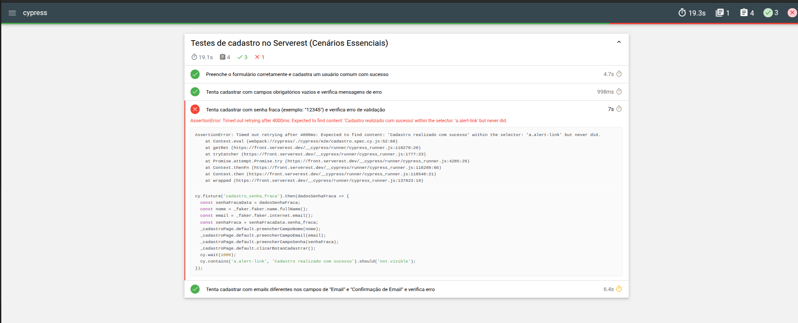

<h1 align="center">Desafio de testes automatizados de interface (UI)</h1>

<p align="center">
  
  
  
</p>

<p align="center">
 Testes automatizados de ponta a ponta para a funcionalidade de cadastro no Serverest.
</p>

Este repositório contém testes automatizados para a funcionalidade de cadastro de usuários no site Serverest ([https://front.serverest.dev/](https://front.serverest.dev/)). O objetivo é garantir a qualidade e robustez do processo de cadastro, cobrindo cenários positivos e negativos, e fornecendo relatórios detalhados. Utilizamos o padrão Page Object Model (POM) para melhor organização e manutenibilidade.

## ✨ Visão Geral

O Serverest é uma plataforma para testes de API REST, e este projeto foca na interface web de cadastro. Os testes são desenvolvidos com Cypress, simulando interações do usuário.  Dados aleatórios são gerados com Faker.js, e relatórios são gerados com Mochawesome.

## 🛠️ Tecnologias Utilizadas

*   **Cypress:** Framework de testes end-to-end para aplicações web.
*   **Mochawesome:** Gerador de relatórios de testes em HTML.
*   **Faker.js:** Biblioteca para geração de dados de teste aleatórios.

## ⚙️ Pré-requisitos

Node.js e npm (ou Yarn) instalados.

## 📦 Instalação

1.  Instale as dependências:

    ```bash
    npm install
    ```

## 🚀 Execução dos Testes

1.  Execute os testes:

    ```bash
    npm run cy:run
    ```

    O Cypress Test Runner será aberto, permitindo acompanhar a execução em tempo real.

## 📊 Geração de Relatórios

1.  Gere o relatório Mochawesome:

    ```bash
    npm run cy:report
    ```

2.  Abra o relatório HTML:  O relatório estará na pasta `mochawesome-report`. Abra o arquivo `mochawesome.html`.

## 🗂️ Estrutura do Projeto

O projeto segue a seguinte estrutura de diretórios e arquivos:

*   **`cypress/`**:  Diretório raiz contendo todos os arquivos relacionados aos testes Cypress.
    *   **`docs/`**:  Armazena documentação adicional, como imagens e relatórios (pode conter o printscreen dos resultados, por exemplo).
    *   **`e2e/`**:  Contém os arquivos de teste end-to-end (especificações).  É aqui que a lógica dos testes é escrita.
        *   `cadastro/`: (Subpasta, não mostrada explicitamente na imagem, mas inferida) Conteria os testes específicos para a funcionalidade de cadastro.
    *   **`fixtures/`**:  Contém arquivos de dados estáticos (JSON, por exemplo) usados nos testes.  Isso permite que você separe os dados dos seus testes, tornando-os mais gerenciáveis e reutilizáveis.
    *   **`pages/`**:  Contém os arquivos de Page Objects.  Cada arquivo representa uma página (ou componente reutilizável) da aplicação, encapsulando os seletores e ações relacionados.
        *   `cadastroPage.js`: (Arquivo, não mostrado explicitamente na imagem, mas mencionado anteriormente) Page Object da página de cadastro.
    *  **`reports/`:** Contém relatorios que podem ser gerados.
    *   **`screenshots/`**:  Armazena automaticamente capturas de tela de testes falhados.  Isso é extremamente útil para depuração.
    *   **`support/`**:  Contém arquivos de suporte para os testes, como comandos customizados (`commands.js`) e configurações globais (`e2e.js` ou `support.js`, dependendo da versão do Cypress).
    *   **`mochawesome-report/`**:  Diretório criado *após* a execução dos testes com o relatório Mochawesome. Contém os arquivos HTML, CSS e JavaScript do relatório.
*   **`node_modules/`**:  Diretório que contém todas as dependências do projeto (bibliotecas externas) instaladas pelo npm (ou Yarn).  Você *não* deve modificar o conteúdo desta pasta diretamente.
*   **`.gitignore`**:  Arquivo de texto que especifica quais arquivos e pastas o Git deve *ignorar* (não incluir no controle de versão).  Geralmente inclui `node_modules/`, arquivos de log, arquivos de configuração local, etc.
*   **`cypress.config.js`**:  Arquivo de configuração principal do Cypress.  Aqui você pode definir opções globais, como `baseUrl`, timeouts, configurações de viewport, etc.
*   **`mochawesome.json`**: Arquivo de configuração opcional para o Mochawesome, onde é possivel definir opções como o diretório de saída dos relatórios, etc.
*   **`package-lock.json`**:  Arquivo gerado automaticamente pelo npm que registra as versões *exatas* de todas as dependências instaladas.  Isso garante que o projeto use as mesmas versões em diferentes ambientes.
*   **`package.json`**:  Arquivo de manifesto do projeto Node.js.  Contém metadados do projeto (nome, versão, descrição), scripts (como `npm run cy:run`) e a lista de dependências (com versões permitidas).
*   **`README.md`**:  Este arquivo!  Um arquivo de texto (em formato Markdown) que descreve o projeto, como usá-lo, como executar os testes, etc.

Essa estrutura é uma prática comum e recomendada para projetos de teste Cypress, promovendo organização, legibilidade e manutenibilidade.

## 🧰 Padrão Page Object Model (POM)

O padrão Page Object Model (POM) é utilizado para organizar o código. Cada página é representada por um arquivo na pasta `cypress/pages`, contendo seletores e ações. Os testes interagem com a página através dos Page Objects.

## 📝 Observações

*   Dados aleatórios (Faker.js) são usados para garantir a variedade dos testes.
*   Screenshots de testes falhados são armazenados em `cypress/screenshots`.

## Contribuição

Contribuições são bem-vindas! Abra issues e pull requests para colaborar.

## 🧪 Resultados dos Testes de Cadastro

Resultados dos testes automatizados de cadastro na aplicação ServeRest.

### Resumo da Execução

*   **Data da Execução:** [Insira a data aqui]
*   **Tempo Total de Execução:** 19.3s
*   **Total de Testes:** 4
*   **Testes Passados:** 3 ✅
*   **Testes Falhados:** 1 ❌
*   **Testes Pendentes/Skipped:** 0

### Visualização dos Resultados


### Detalhes do Teste com Falha

**Teste:** `Tenta cadastrar com emails diferentes nos campos de "Email" e "Confirmação de Email" e verifica erro.`

**Motivo da Falha:**  A aplicação permitiu o cadastro, mesmo com emails diferentes nos campos de "Email" e "Confirmação de Email". O teste esperava que um erro fosse exibido (e, portanto, que o cadastro *não* fosse realizado), mas isso não aconteceu.  Isso indica um bug na validação do formulário de cadastro.

**Erro:** [`AssertionError: Timed out retrying after 4000ms: Expected to find element: 'Cadastre realizado com sucesso!', but never did.`](https://docs.cypress.io/guides/references/error-messages#Errors)

**Código do Teste (com uso de fixture):**

```javascript
it('Tenta cadastrar com emails diferentes nos campos de "Email" e "Confirmação de Email" e verifica erro', () => {
  cy.fixture('cadastro_emails_invalidos').then((dados) => {
    cy.visit('/cadastrarusuarios');
    cadastroPage.preencherCampoNome(faker.person.fullName());
    cadastroPage.preencherCampoEmail(dados.email_invalido);
    cadastroPage.preencherCampoSenha('SenhaValida'); 
      cadastroPage.clicarBotaoCadastrar();
     cy.contains('span', dados.mensagem_email_invalido).should('be.visible'); 
  });
});